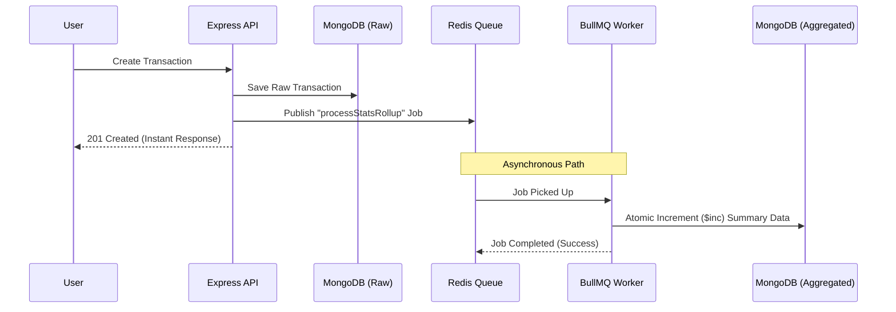

# BullMQ Architecture Analysis: Background Data Aggregation

This document provides a detailed technical analysis of why and how **BullMQ** (Publisher/Worker pattern) is utilized in the backend of the MTTMS application.

## 1. The Core Problem: Synchronous Data Processing
In a financial or ledger application like MTTMS, creating a transaction is just the first step. To provide real-time dashboards (Total Volume, Balance Matrix, Active Records), the system needs to:
1. Save the raw transaction.
2. Update daily summaries (rollups).
3. Recalculate currency-specific balances.
4. Update user-specific activity metrics.

If these steps were done **synchronously** inside the API controller:
- **Latent Response**: The user would have to wait several extra milliseconds for DB calculations.
- **Concurrency Locks**: Heavy "read-modify-write" cycles on summary documents could cause "Database Locks," slowing down other users.
- **Single Point of Failure**: If the statistics update fails (due to a transient DB error), the entire transaction creation might fail or stay in an inconsistent state.

---

## 2. The Solution: Asynchronous Processing (CQRS Style)
MTTMS uses a **Command Query Responsibility Segregation (CQRS)** inspired approach using BullMQ and Redis.

### Architectural Workflow



---

## 3. Component Breakdown

### A. The Publisher (transactionQueue.js)
The **Publisher** is responsible for "offloading" the work. It defines what needs to happen but doesn't do it itself.

**Example Implementation:**
```javascript
// Published a job to the 'transactionEvents' queue
export const publishTransactionCreated = async (transaction) => {
    await transactionEventsQueue.add('processStatsRollup', transaction, {
        attempts: 3,           // Retry 3 times if it fails
        backoff: {             // Wait longer between each retry
            type: 'exponential',
            delay: 1000,
        },
    });
};
```

### B. The Worker (statsWorker.js)
The **Worker** is the "heavy lifter." It runs in the background (potentially on a separate CPU core or even a separate server) and processes jobs one by one.

**Example Implementation:**
```javascript
const worker = new Worker('transactionEvents', async (job) => {
    const tx = job.data;
    // Perform heavy aggregation/calculation
    await DailyLedgerRollup.findOneAndUpdate(
        { date: txDate, ... },
        { $inc: { totalPayoutLkr: tx.totalPayout } }, // Atomic update
        { upsert: true }
    );
}, { connection: redisConnection, concurrency: 5 });
```

---

## 4. Key Benefits Revealed in the Code

1.  **Durability (Reliability)**: In `transactionQueue.js`, jobs are configured with `attempts: 3`. If the database is temporarily down, BullMQ will automatically retry the task later.
2.  **Concurrency Control**: The worker has `concurrency: 5`. This means it can process up to 5 transaction aggregations at the same time without overwhelming the database.
3.  **Atomic Operations**: By using `$inc` inside the worker, the system ensures that even if multiple transactions happen simultaneously, the counters in the `DailyLedgerRollup` model remain accurate without manual locks.
4.  **Scalability**: If the application grows and there are thousands of transactions per second, you can simply start more "Worker" instances across multiple servers to handle the queue load.

## 5. Summary Table
| Feature | Synchronous (No BullMQ) | Asynchronous (With BullMQ) |
| :--- | :--- | :--- |
| **User Wait Time** | High (Waiting for all DB updates) | Minimal (Response sent after raw save) |
| **System Reliability** | If stats fail, transaction fails | Stats can retry independently if they fail |
| **DB Pressure** | Scattered, unpredictable | Controlled via `concurrency` settings |
| **Error Isolation** | API produces 500 errors | UI stays fast; errors logged in background |
